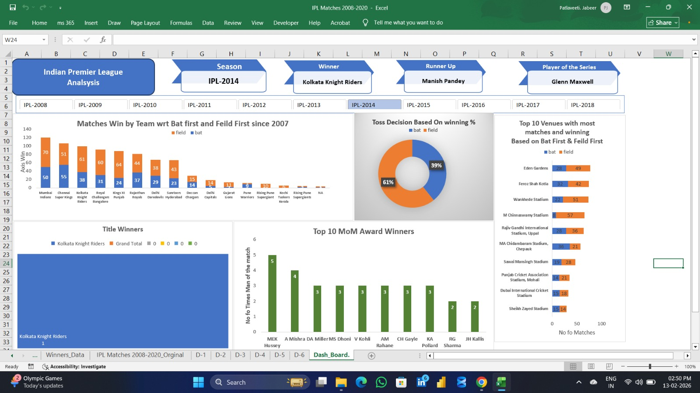

# IPL-Analysis-Excel-Dashboard
"An interactive Excel dashboard analyzing Indian Premier League (IPL) data (2008-2020), featuring season-wise performance, team statistics, and player insights."

IPL Data Analysis & Interactive Dashboard

Project Overview
Developed a comprehensive end-to-end data analysis solution using Advanced Excel to uncover insights from IPL matches spanning 2008 to 2020. This project transforms raw match data into a strategic tool for tracking team performance, toss impacts, and player accolades.

Key Features & Insights
Season-Wise Performance: Utilized Slicers to allow dynamic filtering by season (e.g., IPL-2014), instantly updating winners, runners-up, and Player of the Series.

Match Analysis: Designed a comparative bar chart showing "Matches Win by Team" based on "Batting First" vs. "Fielding First".

Toss Strategy: Built a donut chart revealing that teams winning the toss chose to field 61% of the time, providing a strategic look at match-day decisions.

Venue & Player Metrics: Identified top 10 venues and MoM (Man of the Match) winners using Pivot Tables and ranked analysis.

Technical Toolkit
Data Cleaning: Used Flash Fill (Ctrl+E) and Excel functions to handle date formats and season labeling.

Data Modeling: Established relationships between datasets using Pivot Tables and Calculated Fields.

Visualization: Interactive Dashboard with Slicers, Timeline, and Custom Formatting for professional reporting.
